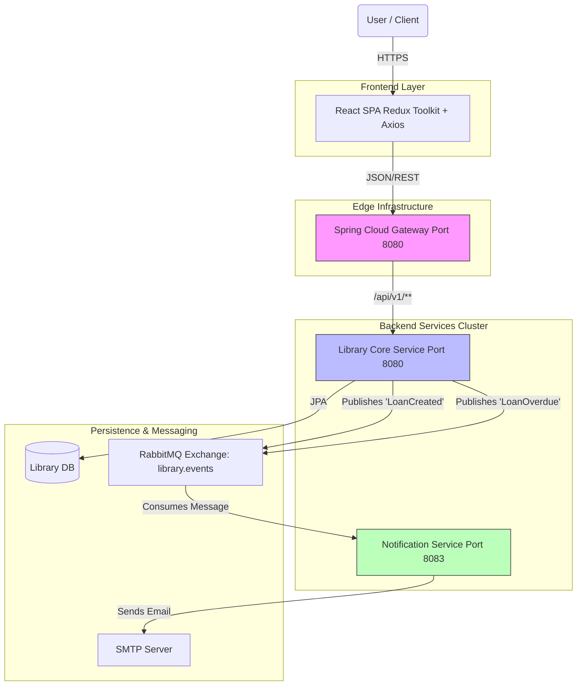
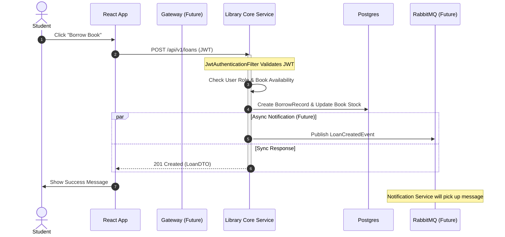

# Executive Summary

The **E-Library System** is architected as a **Distributed Service-Based Platform**. It balances the complexity of distributed systems with the transactional integrity required for inventory management.

The system is composed of **four deployable units** that separate concerns into:

1. **Edge Routing:** `Gateway Service` (lib-gateway)
2. **Core Domain Logic:** `Library Core Service` (lib-core) - Books, Loans, Users, Auth
3. **Asynchronous Messaging:** `Notification Service` (lib-notifications)

This architecture fulfills the semester requirement for **Microservices** and **Layered Architecture**, while using **React** for a responsive client experience.

---

# High-Level Architecture (C4 Container View)

The system uses a **Hub-and-Spoke** topology where the **Gateway** is the single entry point. Synchronous operations (REST) handle user requests, while Asynchronous operations (RabbitMQ) handle side effects like emails.



---

## Detailed Component Design

### Frontend: React Client

* **Tech Stack:** React 18, Redux Toolkit, React Router, Axios, Material UI.
* **Responsibilities:**

**State Management:** Uses **Redux Toolkit** (slices/thunks) to handle API states (`pending`, `fulfilled`, `rejected`).

**Routing:** Dynamic routes for book details (`/books/:id`) and Protected Routes for Admin panels.

**Security:** Interceptors handle 401 Unauthorized responses to redirect to login.

### Service 1: Spring Cloud Gateway (lib-gateway) **IMPLEMENTED**

* **Role:** The "Front Door." No client talks directly to backend services.
* **Architecture:** Reactive gateway with centralized security and routing

**Gateway Configuration:**

- `application.yml` - Path-based routing configuration
  - Public routes: `/api/v1/auth/**` (no authentication)
  - Protected routes: `/api/v1/books/**` (requires USER/ADMIN role)
  - Admin routes: `/api/v1/users/**` (requires ADMIN role)
  - CORS configuration for frontend origins

**JWT Authentication:**

- `JwtAuthenticationFilter.java` - Validates JWT tokens at gateway level
  - Extracts Bearer tokens from Authorization header
  - Validates token signature and expiration
  - Passes user info (ID, roles) to downstream services via headers
  - Returns 401 for invalid or missing tokens

**CORS Configuration:**

- `CorsConfig.java` - Centralized CORS policy
  - Allows requests from `http://localhost:3000` and `http://localhost:8080`
  - Configures allowed methods (GET, POST, PUT, DELETE, OPTIONS)
  - Enables credentials for authentication

**Routing Strategy:**

- **Single entry point:** Port 8081 for all client requests
- **Path predicates:** Route determination based on request path
- **Header propagation:** User info passed via `X-User-Id` and `X-User-Roles` headers
- **Strip prefix:** Removes `/api/v1` before forwarding to lib-core

**Request Flow:**

1. Client → Gateway (port 8081) with JWT
2. Gateway validates JWT via `JwtAuthenticationFilter`
3. Route determination based on path predicates
4. Request forwarded to lib-core (port 8080) with user headers
5. Response routed back to client

* **Status:** Implemented and running on port 8081

### Service 2: Library Core Service (lib-core) **IMPLEMENTED**

* **Role:** The primary business unit. It encapsulates the `Book`, `User`, and `Loan` domains with integrated authentication.
* **Architecture:** Adheres to **Strict Layered Architecture**:

**Controller:** Handles DTO mapping and `@Valid` input validation.

- `AuthController.java` - Authentication endpoints
- `BookController.java` - Book management
- `UserController.java` - User administration

**Service:** Handles business rules and authentication.

- `AuthService.java` - User registration/login
- `BookService.java` - Book inventory logic
- `UserService.java` - User management
- `JwtService.java` - JWT token generation/validation

**Repository:** Extends `JpaRepository` for DB access.

- `UserRepository.java` - User data access with custom queries
- `BookRepository.java` - Book data access
- `BorrowRecordRepository.java` - Loan tracking

**Entity:** JPA domain models.

- `User.java` - Complete user entity with roles and auditing
- `Book.java` - Book inventory entity
- `BorrowRecord.java` - Loan tracking entity

**Security:** Integrated JWT-based authentication.

- `SecurityConfig.java` - Complete Spring Security setup with role-based access
- `JwtAuthenticationFilter.java` - JWT validation filter

**API Design:** RESTful endpoints using DTOs to decouple the DB schema.

### Service 3: Notification Service (lib-notifications) **IMPLEMENTED**

* **Role:** Asynchronous consumer that listens to RabbitMQ events and sends email communications.
* **Pattern:** **Event-Driven Consumer** with Topic Exchange routing.
* **Architecture:** Spring Boot service with RabbitMQ integration and SMTP email capabilities.

**RabbitMQ Configuration:**

- `RabbitMQConfig.java` - Complete RabbitMQ setup
  - Topic Exchange: `elib.notifications`
  - Queue: `email.queue` with durable persistence
  - Routing Key: `email.#` for flexible email routing
  - JSON message converter for structured payloads

**Email Service:**

- `EmailService.java` - SMTP email sending with error handling
  - Uses Spring Boot Mail Starter for SMTP integration
  - Handles email sending failures with custom exceptions
  - Logs success/failure for monitoring

**Notification Consumer:**

- `NotificationConsumer.java` - RabbitMQ message listener
  - Listens to `email.queue` for email notifications
  - Processes `EmailNotificationDto` payloads
  - Calls `EmailService` for email delivery
  - Handles failures with proper error propagation

**Data Transfer Objects:**

- `EmailNotificationDto.java` - Record for email notification data
  - Notification type, recipient email, subject, body
  - Generic payload for event-specific data

**Error Handling:**

- `GlobalExceptionHandler.java` - Centralized exception handling
  - Maps email sending failures to standardized error responses
  - Provides consistent error logging and response format

**Configuration:**

- Port 8082 for notifications service
- Environment-specific configurations (dev/prod)
- RabbitMQ connection with JSON message converter
- SMTP configuration with TLS support

**Event Types Supported:**

- `email.loan.created` → Sends "Booking Confirmation" email
- `email.loan.overdue` → Sends "Overdue Alert" email
- `email.user.welcome` → Sends "Welcome" email for new registrations
- `email.user.password_reset` → Sends "Password Reset" email

**Message Flow:**

1. lib-core publishes event to RabbitMQ exchange `elib.notifications`
2. RabbitMQ routes message to `email.queue` based on routing key
3. NotificationConsumer receives and processes the message
4. EmailService sends email via configured SMTP server
5. Success/failure logged for monitoring

* **Status:** Implemented and ready for integration with lib-core

---

## Key Architectural Patterns (Implemented in lib-core)

### Security & Authentication

* **Stateless:** The system uses **JSON Web Tokens (JWT)**.
* **Flow:**

1. User logs in via `lib-core` `/api/v1/auth/login`
2. `lib-core` returns a JWT (access + refresh tokens)
3. React stores JWT (localStorage/memory)
4. React sends JWT in `Authorization: Bearer <token>` header for every request
5. **Custom Filter:** `JwtAuthenticationFilter` intercepts requests, validates the signature, and sets the `SecurityContext`

### Database Strategy

* **Single Database:** PostgreSQL with schema `elibrary`
* **Entities:** Combined User, Book, and BorrowRecord in same database
* **Auditing:** All entities include `createdAt` and `updatedAt` timestamps
* **Roles:** User roles stored as `Set<String>` in User entity

### Error Handling

* **Global Handler:** `GlobalExceptionHandler.java` uses `@ControllerAdvice`
* **Standard Response:**

```json
{
  "timestamp": "2023-10-27T10:00:00",
  "status": 404,
  "error": "Not Found",
  "message": "Book with ID 123 not found",
  "path": "/api/v1/books/123"
}
```

### API Documentation

* **SpringDoc OpenAPI:** Automatic API documentation
* **Swagger UI:** Interactive API testing at `/api/swagger-ui.html`
* **OpenAPI Spec:** Available at `/api/v3/api-docs`

---

## Domain Model & Data Strategy (Implemented)

### Library Database (Schema: `elibrary`)

* **User Table:** `users` - Complete user management
  - `id`, `email`, `password`, `username`, `first_name`, `last_name`
  - `roles` (via `user_roles` join table), `is_active`, timestamps
* **Book Table:** `book` - Book inventory
* **BorrowRecord Table:** `borrow_record` - Loan tracking
* **User Roles Table:** `user_roles` - Role assignments

*Note: The system uses a unified database approach with all entities in the same schema for simplicity in the initial implementation.*

---

## Sequence Diagram: The Borrowing Flow (Updated)

This demonstrates the full lifecycle with implemented lib-core:



---

## Implementation Status

### **COMPLETED - lib-core**

- **Authentication:** JWT-based with access/refresh tokens
- **Authorization:** Role-based (USER, ADMIN)
- **Entities:** User, Book, BorrowRecord with full JPA mappings
- **API Layer:** Controllers, Services, Repositories
- **Security:** Spring Security with custom JWT filter
- **Documentation:** OpenAPI 3 with Swagger UI
- **Configuration:** Complete application.yml with PostgreSQL, JWT settings

### **IMPLEMENTED**

- **lib-gateway:** Spring Cloud Gateway (running on port 8081)
- **lib-notifications:** Notification service (running on port 8082)

### **TECHNOLOGY CHECKLIST**


| Area               | Technology            | Status      | Notes                         |
| ------------------ | --------------------- | ----------- | ----------------------------- |
| **Language**       | Java 21               | Done        | Java 21 with Maven            |
| **Framework**      | Spring Boot 3         | Done        | lib-core implemented          |
| **Security**       | Spring Security + JWT | Done        | Complete implementation       |
| **Database**       | PostgreSQL            | Done        | Configured in application.yml |
| **API Docs**       | SpringDoc OpenAPI     | Done        | Swagger UI available          |
| **Object Mapping** | MapStruct             | Done        | BookMapper, UserMapper        |
| **Build Tool**     | Maven                 | Done        | Multi-module project          |
| **Gateway**        | Spring Cloud Gateway  | Implemented | Running on port 8081          |
| **Messaging**      | RabbitMQ              | Implemented | lib-notifications integrated  |
| **Frontend**       | React 19              | Initialized | Frontend directory exists     |

---

## Next Steps

1. **Integrate lib-core with lib-notifications** - Publish events from lib-core to RabbitMQ
2. **Develop frontend** - React application to consume the APIs
3. **Add testing** - Unit and integration tests for all modules
4. **Deploy** - Docker Compose setup for local development and production
