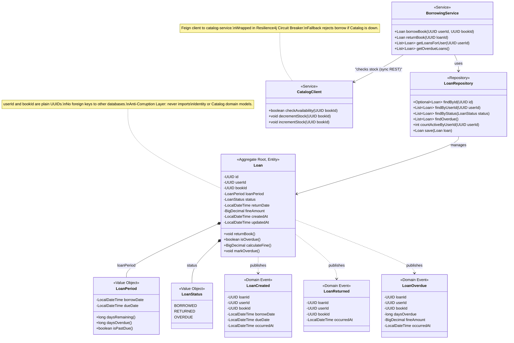

# Borrowing Bounded Context: Tactical DDD Model

**Owner:** Elliot Vowles (22299211)
**Service:** `borrowing-service` (Port 8085)
**Database:** `elib_borrowing_db`

## Ubiquitous Language

- **Loan**: A record of a User borrowing a Book from the library. Each Loan is independent and tracks dates, status, and any fines.
- **Borrow**: The act of checking out a Book, which creates a Loan and decrements catalog stock.
- **Return**: The act of giving back a borrowed Book, which updates the Loan status and increments catalog stock.
- **Due Date**: The date by which a Loan must be returned (default: 2 weeks from borrow date).
- **Overdue**: A Loan whose due date has passed without the Book being returned.
- **Fine**: A monetary penalty accrued for overdue Loans (1 GBP base, +1 GBP per day overdue). Displayed but paid in person.

## UML Class Diagram (DDD)

## Aggregate Design

**Aggregate Root:** `Loan`

**Boundary Justification:** Each Loan is an independent transactional unit. A Loan tracks the full lifecycle of one borrowing event: from creation through potential overdue to eventual return. LoanPeriod and LoanStatus are Value Objects owned by the Loan aggregate. The Loan stores only `userId` and `bookId` as plain UUIDs, maintaining strict context boundaries (no foreign keys to Identity or Catalog databases).

## Invariants

1. **Stock availability:** A Loan cannot be created if the Book has no available copies. Enforced by synchronous check to Catalog service before creating the Loan.
2. **No double return:** A Loan with status `RETURNED` cannot be returned again. The `returnBook` operation must reject if status is already `RETURNED`.
3. **Positive loan period:** The due date must be after the borrow date. Default period is 2 weeks.
4. **Maximum active loans:** A User may have at most 5 active Loans (status `BORROWED` or `OVERDUE`). Enforced by counting active loans before creation.
5. **Fine calculation:** Fines accrue at 1 GBP per day overdue, starting at 1 GBP on the first overdue day.

## Borrow Flow (orchestrated by BorrowingService)

1. Check that User has fewer than 5 active loans
2. Call `CatalogClient.checkAvailability(bookId)` (sync REST, circuit breaker)
3. Call `CatalogClient.decrementStock(bookId)` (sync REST)
4. Create `Loan` with status `BORROWED`, borrow date = now, due date = now + 14 days
5. Publish `LoanCreated` event to RabbitMQ

## Return Flow

1. Load Loan by ID, verify status is `BORROWED` or `OVERDUE`
2. Set status to `RETURNED`, set return date = now
3. Call `CatalogClient.incrementStock(bookId)` (sync REST)
4. Publish `LoanReturned` event to RabbitMQ

## Domain Events

| Event | Trigger | Consumers |
|-------|---------|-----------|
| `LoanCreated` | A User successfully borrows a Book | Notification context (booking confirmation) |
| `LoanReturned` | A User returns a borrowed Book | Notification context (return confirmation) |
| `LoanOverdue` | Scheduled job detects a Loan past its due date | Notification context (overdue reminder) |
