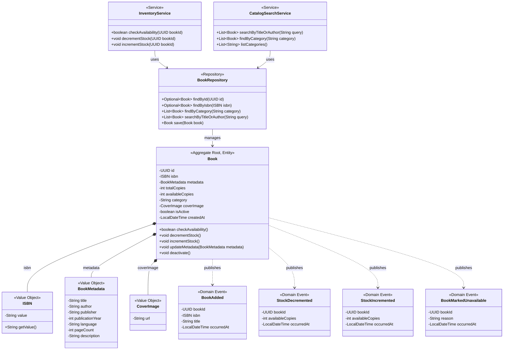

# Catalog Bounded Context: Tactical DDD Model

**Owner:** Stephen Walsh (21334234)
**Service:** `catalog-service` (Port 8084)
**Database:** `elib_catalog_db`

## Ubiquitous Language

- **Book**: A library item that can be browsed, borrowed, and returned. Identified by a unique ISBN.
- **ISBN**: The International Standard Book Number. A globally unique identifier for a published title.
- **Inventory/Stock**: The count of physical copies available. Managed through decrement (on borrow) and increment (on return) operations.
- **Category**: The genre or subject classification of a Book.

## UML Class Diagram (DDD)

## Aggregate Design

**Aggregate Root:** `Book`

**Boundary Justification:** The Book entity is the transactional boundary for metadata and stock management. ISBN, BookMetadata, and CoverImage are Value Objects that exist only within the Book aggregate. Stock operations (decrement/increment) must be atomic to maintain the invariant that `availableCopies` never goes negative or exceeds `totalCopies`.

## Invariants

1. **ISBN uniqueness:** No two Books may share the same ISBN. Enforced at the repository level via unique constraint.
2. **Stock floor:** `availableCopies >= 0`. The `decrementStock` operation must reject if `availableCopies` is already 0.
3. **Stock ceiling:** `availableCopies <= totalCopies`. The `incrementStock` operation must not exceed `totalCopies`.
4. **Positive page count:** `pageCount > 0` when specified.

## Domain Events

| Event | Trigger | Consumers |
|-------|---------|-----------|
| `BookAdded` | A librarian adds a new book to the catalog | (internal, for audit) |
| `StockDecremented` | Borrowing service requests stock decrement after loan creation | (internal) |
| `StockIncremented` | Borrowing service requests stock increment after loan return | (internal) |
| `BookMarkedUnavailable` | A librarian deactivates a book (`isActive = false`) | (internal, for audit) |
