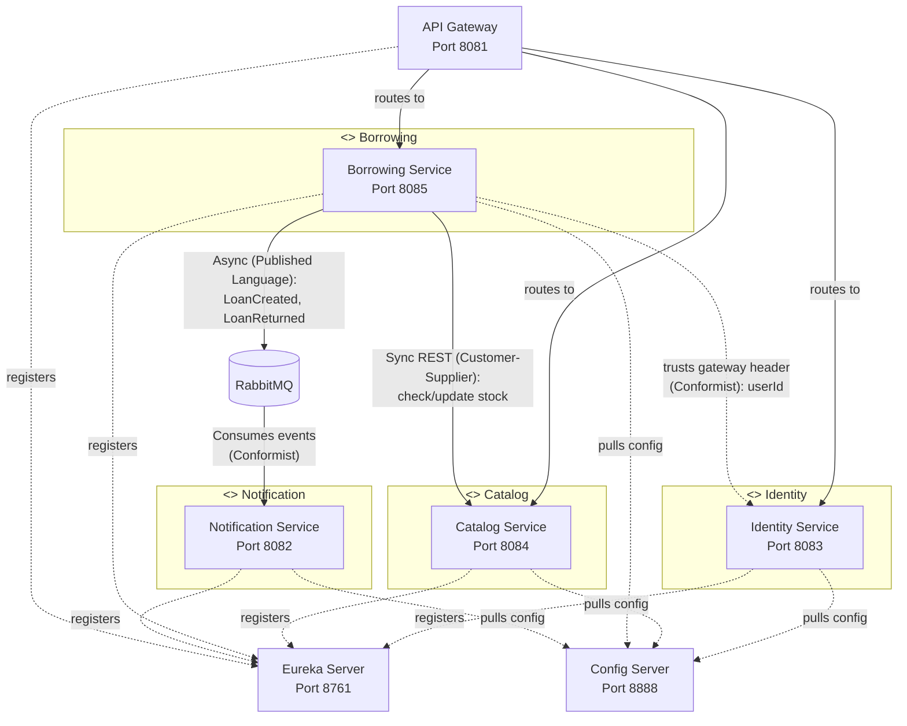

# Context Map

## Bounded Context Ownership

| Bounded Context | Owner | Service Name | Port | Database |
|-----------------|-------|--------------|------|----------|
| Identity | Benjamin Burt (22360255) | `identity-service` | 8083 | `elib_identity_db` |
| Catalog | Stephen Walsh (21334234) | `catalog-service` | 8084 | `elib_catalog_db` |
| Borrowing | Elliot Vowles (22299211) | `borrowing-service` | 8085 | `elib_borrowing_db` |
| Notification | Piotr Pawlowski (21304858) | `notification-service` | 8082 | (stateless) |

## Cross-Context Dependencies

## Relationship Types

| Upstream | Downstream | Relationship | Pattern |
|----------|------------|--------------|---------|
| Catalog | Borrowing | Customer-Supplier | Borrowing (customer) calls Catalog (supplier) via synchronous REST to check and update stock. Catalog exposes a Published Language (stock availability API). Borrowing uses an Anti-Corruption Layer (local `CatalogStockResponse` DTO) to avoid importing Catalog's domain model. |
| Identity | Borrowing | Conformist | Borrowing trusts the `userId` from the JWT/gateway header. It stores only the `userId` (a UUID) and never imports Identity's domain model. No direct REST call needed. |
| Borrowing | Notification | Published Language | Borrowing publishes domain events (`LoanCreated`, `LoanReturned`, `LoanOverdue`) to RabbitMQ. Notification consumes these events. Notification uses a local `NotificationEventDto` to map from the message, never depending on Borrowing's internal model. |
| Identity | Gateway | Published Language | Identity defines the JWT claims schema (`sub`, `roles`, `exp`). Gateway validates tokens using the shared JWT secret. |

## Anti-Corruption Strategies

- **Borrowing context**: stores only `userId` (UUID) and `bookId` (UUID) as plain references. Never imports `User` or `Book` entities from other contexts. Uses a local Feign client that returns `CatalogStockResponse` DTO.
- **Notification context**: maps incoming RabbitMQ messages to a local `NotificationEventDto`. Never depends on Borrowing's internal `Loan` entity.
- **Gateway**: validates JWT tokens independently using the shared secret. Does not call Identity service for validation; propagates user info via `X-User-Id` and `X-User-Roles` headers.

## Infrastructure Services

| Service | Role | Port |
|---------|------|------|
| API Gateway | Single entry point, JWT validation, path-based routing via Eureka `lb://` | 8081 |
| Eureka Server | Service discovery and registration | 8761 |
| Config Server | Centralized externalized configuration with environment separation | 8888 |
| RabbitMQ | Asynchronous messaging between Borrowing and Notification | 5672 |
| PostgreSQL | Three isolated databases (one per data-owning context) | 5432 |
