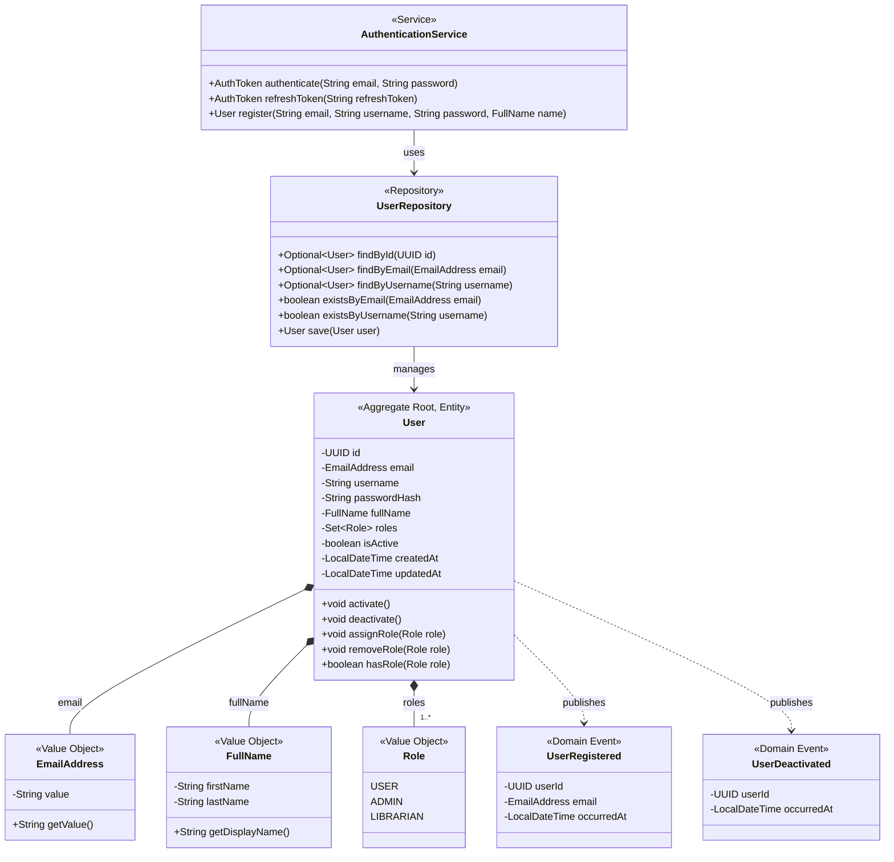

# Identity Bounded Context: Tactical DDD Model

**Owner:** Benjamin Burt (22360255)
**Service:** `identity-service` (Port 8083)
**Database:** `elib_identity_db`

## Ubiquitous Language

- **User**: A registered individual who can authenticate and interact with the library system. Distinguished by a unique email address and username.
- **Role**: The authorization level assigned to a User (USER, LIBRARIAN, ADMIN). Determines what operations the User may perform. LIBRARIAN and ADMIN have similar permissions (stock management, user management), with ADMIN having full system access.
- **Credential**: The combination of email/username and password used to authenticate.
- **Authentication Token**: A JWT issued upon successful authentication, carrying the User's identity and roles.

## UML Class Diagram (DDD)

## Aggregate Design

**Aggregate Root:** `User`

**Boundary Justification:** The User entity is the transactional boundary for profile data and role assignments. All modifications to a User's email, name, roles, or active status must go through the User aggregate root. EmailAddress, FullName, and Role are Value Objects owned by the User aggregate; they have no independent lifecycle.

## Invariants

1. **Email uniqueness:** No two Users may share the same email address. Enforced at the repository level via unique constraint.
2. **Username uniqueness:** No two Users may share the same username. Enforced at the repository level via unique constraint.
3. **Minimum one role:** A User must have at least one Role assigned at all times. The `removeRole` operation must reject removal of the last role.
4. **Password strength:** Passwords are stored as BCrypt hashes; plaintext passwords are never persisted.

## Domain Events

| Event | Trigger | Consumers |
|-------|---------|-----------|
| `UserRegistered` | A new User successfully completes registration | Notification context (sends welcome email) |
| `UserDeactivated` | An admin deactivates a User account | Notification context (sends account deactivation notice) |
