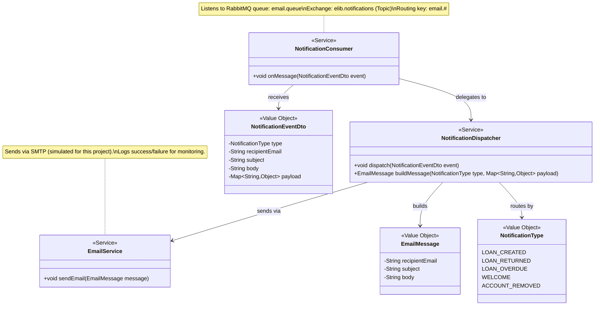

# Notification Bounded Context: Tactical DDD Model

**Owner:** Piotr Pawlowski (21304858)
**Service:** `notification-service` (Port 8082)
**Database:** (stateless, no persistent storage)

## Ubiquitous Language

- **Notification**: A message dispatched to a User in response to a domain event (loan confirmation, overdue reminder, welcome message).
- **Email Message**: The content of a notification, containing a recipient address, subject, and body.
- **Notification Type**: The category of notification, determining the template and content used (LOAN_CREATED, LOAN_RETURNED, LOAN_OVERDUE, WELCOME, ACCOUNT_REMOVED).

## UML Class Diagram (DDD)

## Design Rationale

The Notification context is treated as a **stateless event handler** rather than an aggregate-based domain. This is justified because:

1. Notifications are fire-and-forget; there is no transactional state to manage beyond the act of sending.
2. The context has no entities that require identity tracking or lifecycle management.
3. All inputs arrive as consumed events from other contexts (Borrowing, Identity); the Notification context never initiates domain actions.

If notification history tracking were required in the future, a `Notification` entity could be introduced as an aggregate root, but this is out of scope for the current system.

## Consumed Events

| Event | Source Context | Routing Key | Action |
|-------|---------------|-------------|--------|
| `LoanCreated` | Borrowing | `email.loan.created` | Send booking confirmation to User |
| `LoanReturned` | Borrowing | `email.loan.returned` | Send return confirmation to User |
| `LoanOverdue` | Borrowing | `email.loan.overdue` | Send overdue reminder to User |
| `UserRegistered` | Identity | `email.user.welcome` | Send welcome email to new User |
| `UserDeactivated` | Identity | `email.user.deactivated` | Send account deactivation notice |

## Anti-Corruption Layer

The `NotificationEventDto` maps incoming RabbitMQ messages into a local representation. The Notification context never depends on Borrowing's `Loan` entity or Identity's `User` entity. It receives only the information it needs: notification type, recipient email, subject, body, and an optional payload map for template variables.

## RabbitMQ Configuration

- **Exchange:** `elib.notifications` (Topic Exchange)
- **Queue:** `email.queue` (durable)
- **Routing Key Pattern:** `email.#`
- **Message Format:** JSON-serialized `NotificationEventDto`
